

    

This repo aims to <strong>extract GEDI LiDAR full waveforms</strong> in order to <strong>stack them</strong>. 
Full waveforms are the <u>complete return signal of a laser pulse</u>. 

Unlike, <strong>classic LiDAR</strong> which returns <strong>only discrete echoes</strong> and points cloud. 
LiDAR with full waveforms recorders permits to <i>record the entire signal returned from each laser pulse</i>. 

These returned signals, named <strong>full waveforms</strong> are informative of the <strong>ground geometry</strong>, such as <i>slopes and escarpments</i>. 
They can also be informative of the <strong>nature of the ground</strong>, like <i>dense vegetation or bare ground</i>. 

    <a href="https://medium.com/@h.shaig93/lidar-full-waveform-gentle-introduction-fb566c005fa7" target="_blank">
        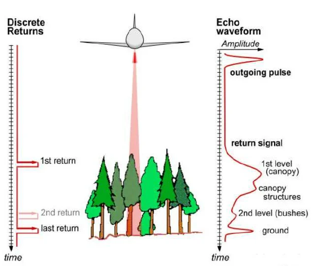
    </a>
    

        <small>
            <a href="https://medium.com/@h.shaig93/lidar-full-waveform-gentle-introduction-fb566c005fa7" target="_blank">
                 Differences between discrete and FWF LiDAR systems 
            </a>
        </small>
    

GEDI Data are produced by 3 lasers (1064 nm, infrared) for a total of 8 beam ground transects, which consist of ~30 meter (m) footprint samples spaced approximately every 60 m along-track and 600 m cross-track for a total swath of about 4.2 km.

    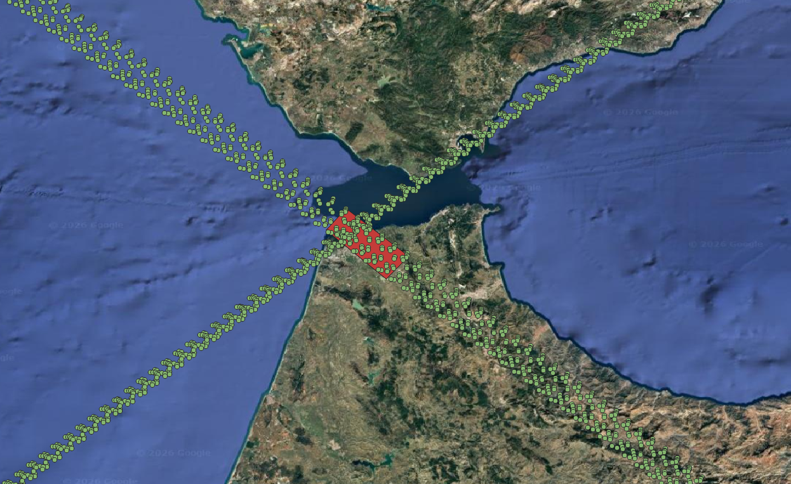
    <small>
        Orbital ground track of GEDI shots
    </small>

To stack the waveforms, we restrict the analysis to a region of interest ([ROI](data/emprise/emprise_gedi.geojson)) to reduce the data volume.

    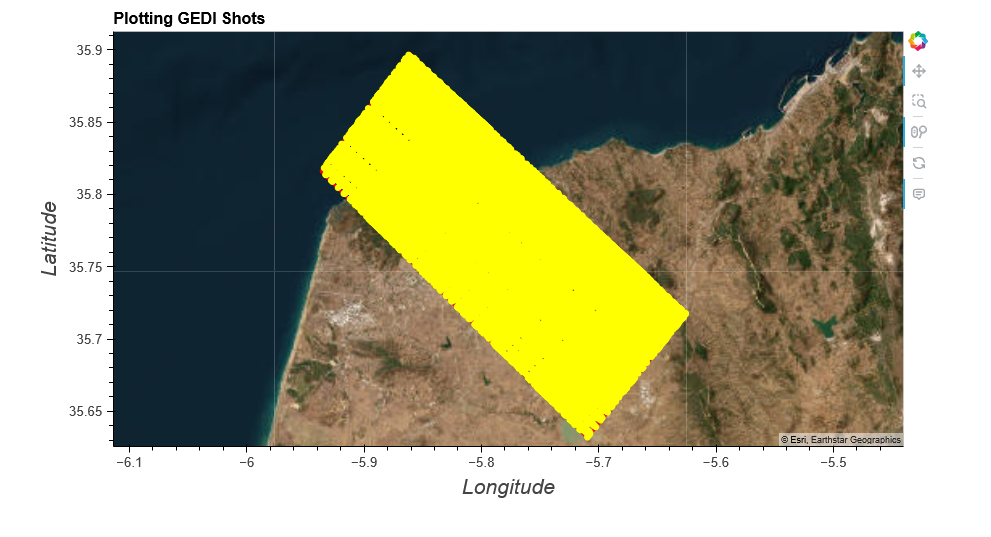
    <small>
        GEDI shots in ROI
    </small>

Find the list of the downloaded Granules L1B et L2A [here](data/granules/l1b/GEDI_granules_list_l1b.txt) and [here](data/granules/l2a/GEDI_granules_list_l2a.txt).

L1B : Is the product which contains all geolocated returns waveforms ([source](https://lpdaac.usgs.gov/documents/997/GEDI01B_User_Guide_V21.pdf)).

L2A : Is the product which contains derived metrics, Elevation and Relative Canopy Height, extracted from return waveforms and a set of quality metrics and flags to filter shots with the poor geolocation performance, waveforms of poor signal quality ([source](https://lpdaac.usgs.gov/documents/998/GEDI02_UserGuide_V21.pdf)).

Each shots is unique and identifiable by its shots number `{beamName}/shot_number`. All the waveforms of a Granule are stored in `{beamName/rxwaveform}` and can be extracted with the `{beamName}/rx_sample_start_index` and the `{beamName}/rx_sample_count`. In the following manner : by slicing the rxwaveform table with `[start: start+count]`, with `start` defined as the <strong>start index of the first sample of the waveform</strong>,  and `count` the <strong>number of samples contained in the waveform</strong>. 

Also, some datasets of L1B are of interest, notably the `'{beamName}/noise_mean_corrected'` this gives the **mean background noise level for the laser shot**.
By substracting this value from the FWF of each shot, the vertical amplitude offset caused by the background noise can be corrected, bringing all FWFs to the same baseline.

The first script ([gedi_fwf_processing_main](gedi_fwf_processing/gedi_fwf_processing_main.py)) consists of visualizing the shots, some corresponding waveforms, and building the grid to see the density of shots per grid cell.

    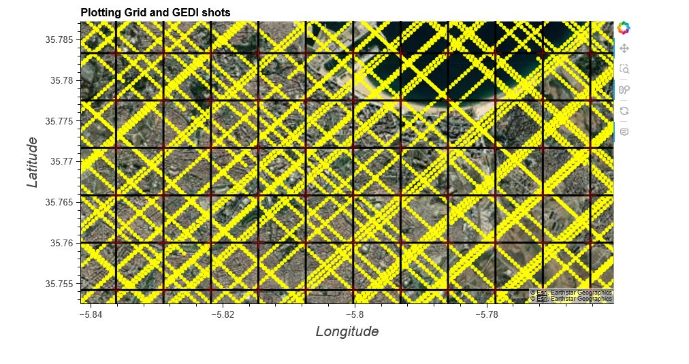
    <small>
        Observing GEDI shot tracks on a 1000 meters resolution grid
    </small>

    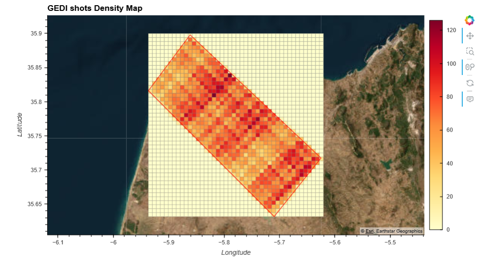
    <small>
        Density of shots per grid cell
    </small>

    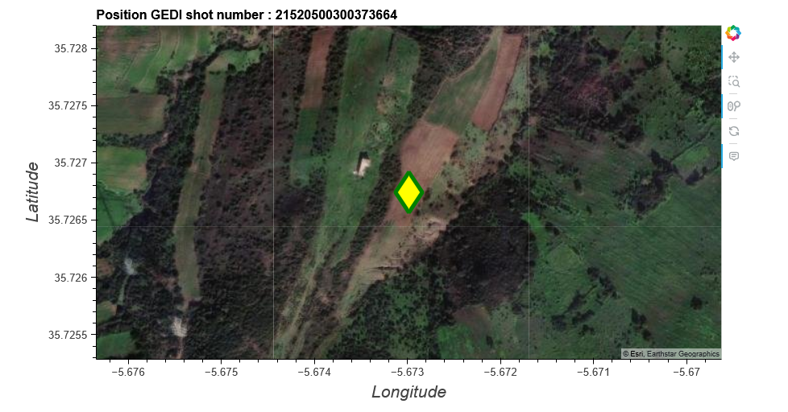
    <small>
        A random shot hitting the ground
    </small>

    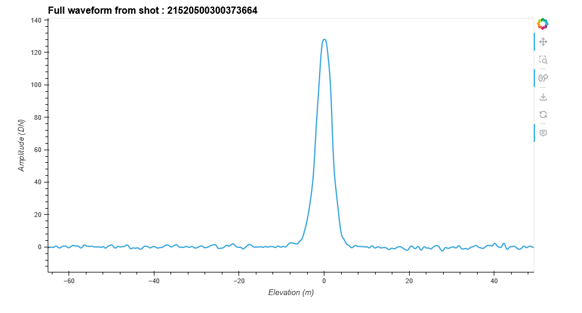
    <small>
        Its corresponding waveform
    </small>

<i>As we can see, when a laser pulse hits the ground, we receive a signal characteristic of it, as it is a unique echo.</i>

When the **shots are hitting vegetation**, the corresponding waveforms will have of **multiple echoes** and be **wider** as the signal returns first from the top of canopy, then from the intermediate vegetation under the canopy, and finally, when the laser penetrate far enough, from the ground. See the following figure ([interpolated_fwf_cell_96](output/data_vizualization/interpolated_fwf_cell_96.png)), to see waveforms characteristics of vegetation.

The second script ([gedi_fwf_stacking_main](gedi_fwf_processing/gedi_fwf_stacking_main.py)) forms the FWF cube by grouping the shots into cells with a 1 km resolution or less (900 m, 800 m, etc.), and aggregates the waveforms by the mean for each cell.

    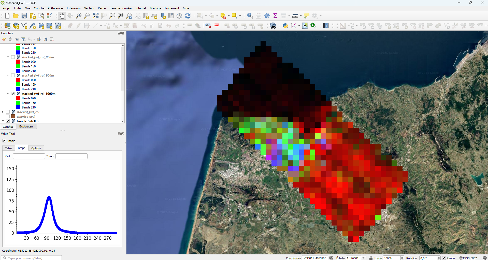
    <small>
        Hyperspectral block of Full waveforms 
    </small>

<i>By putting the 90th band in the red channel, the 150th in the green, and the 210th in the blue, you can guess the **nature of the shots falling in this pixel**.</i>

When the **pixel is red**, the corresponding waveform has a unique echo, meaning the shots are hitting the **ground or buildings**. When the pixel is **dark**, the waveforms are encountering **water**. When it is **green**, it indicates the presence of **vegetation**. When it is **blue or purple**, it means that the pixel is **mixed**, of ground, vegetation, or buildings.

    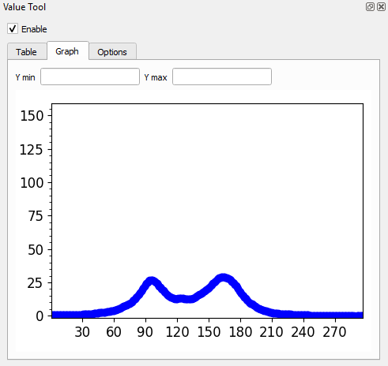
    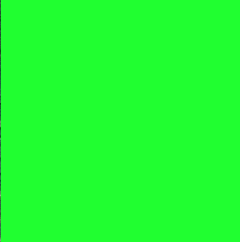
    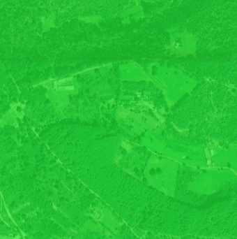  
    <small>
        Full waveform of a green pixel 
    </small>

    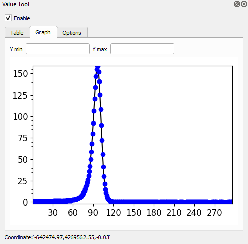
    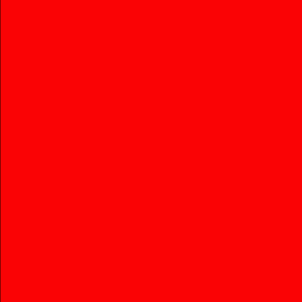
    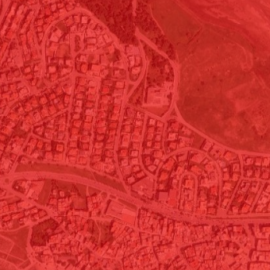  
    <small>
        Full waveform of a red pixel 
    </small>

The third script ([color_composite_fwf_main](gedi_fwf_processing/colored_composite_fwf_main.py)) computes waveform statistics (mean, max, median, std) to create a color composition of the scene by putting the maximum of the waveform in the red channel, the mean of the waveform in the green channel, and the standard deviation of the waveform in the blue channel.

    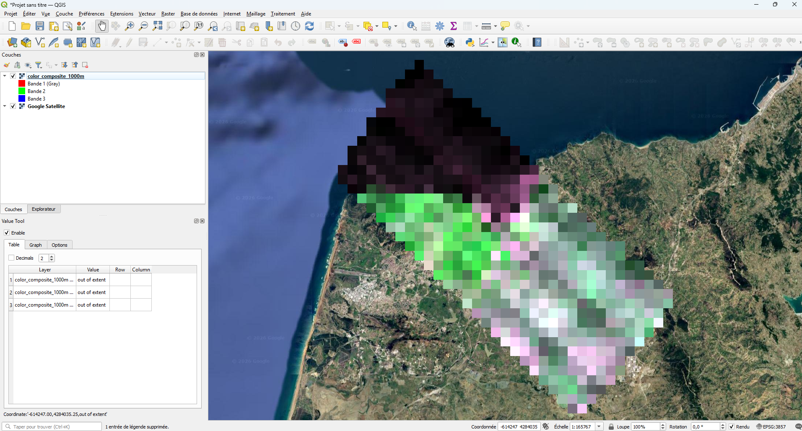
    <small>
        Color composite of FWFs'statistics
    </small>

<i>Pinkish indicates ground or buildings, greenish is vegetation and dark purple indicates water.<i>