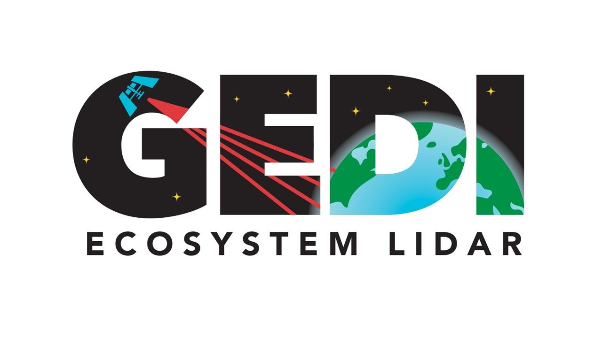

This repo aims to <strong>extract GEDI LiDAR full waveforms</strong> in order to <strong>stack them</strong>. 
Full waveforms are the <u>complete return of laser signal</u>. 

Unlike, <strong>classic LiDAR</strong> which returns <strong>only discreet echoes</strong> and points cloud. 
LiDAR with full waveforms recorders permits to <u>record the entire signal returned by laser impulsed shots</u>. 

These returned signals, named <strong>full waveforms</strong> are informative of the <strong>ground geometry</strong>, such as <i>slopes and escarpments</i>. 
They can also be informative of the <strong>nature of the ground</strong>, like <i>dense vegetation or bare ground</i>. 